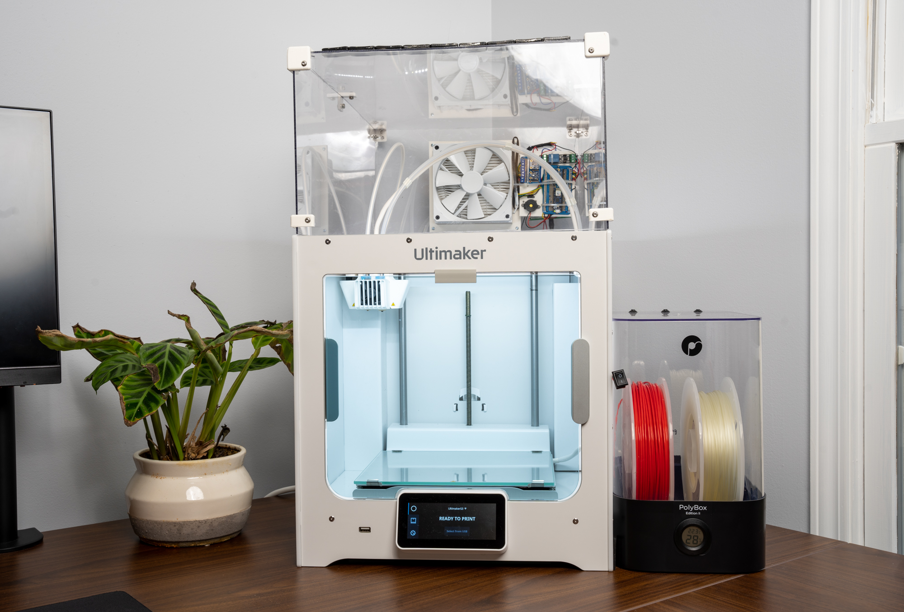
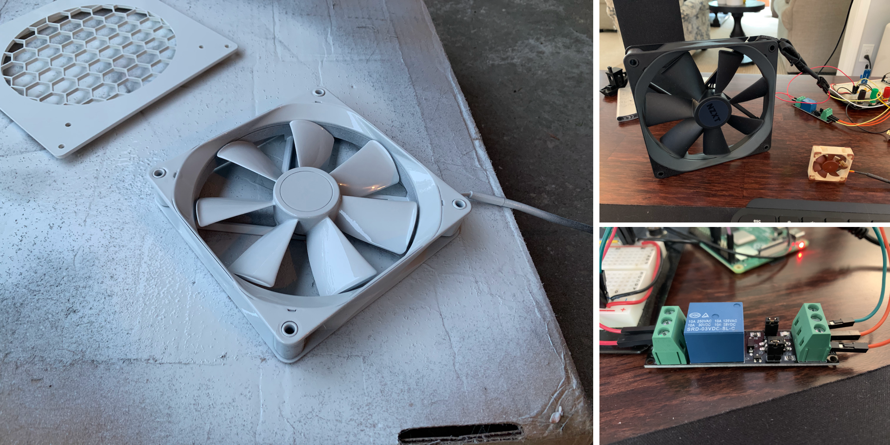
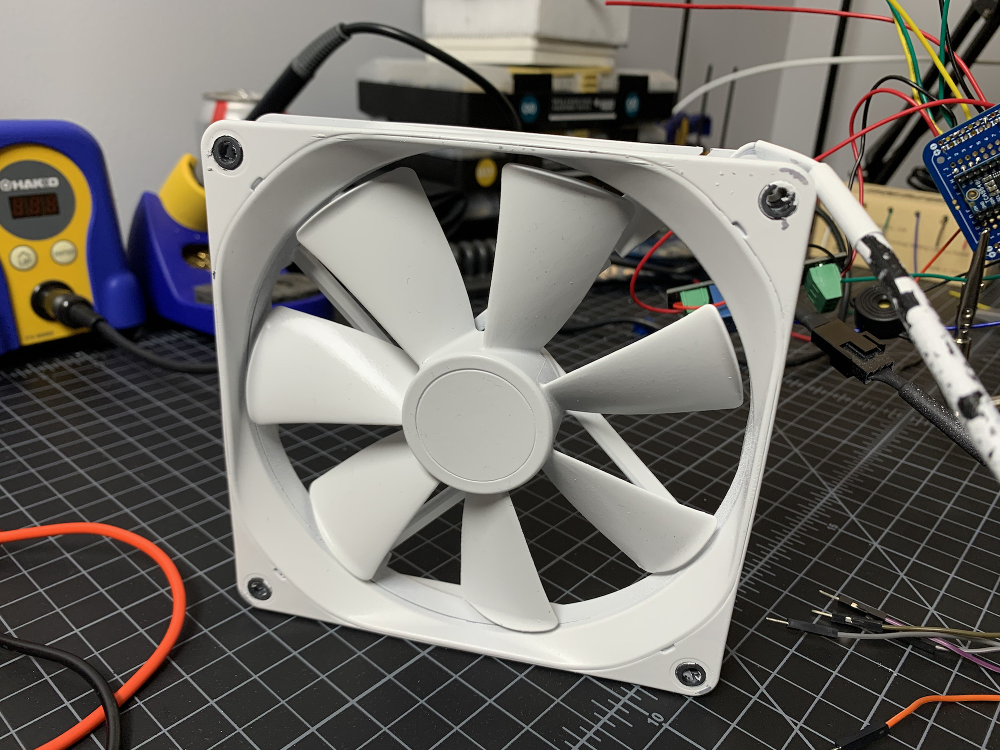
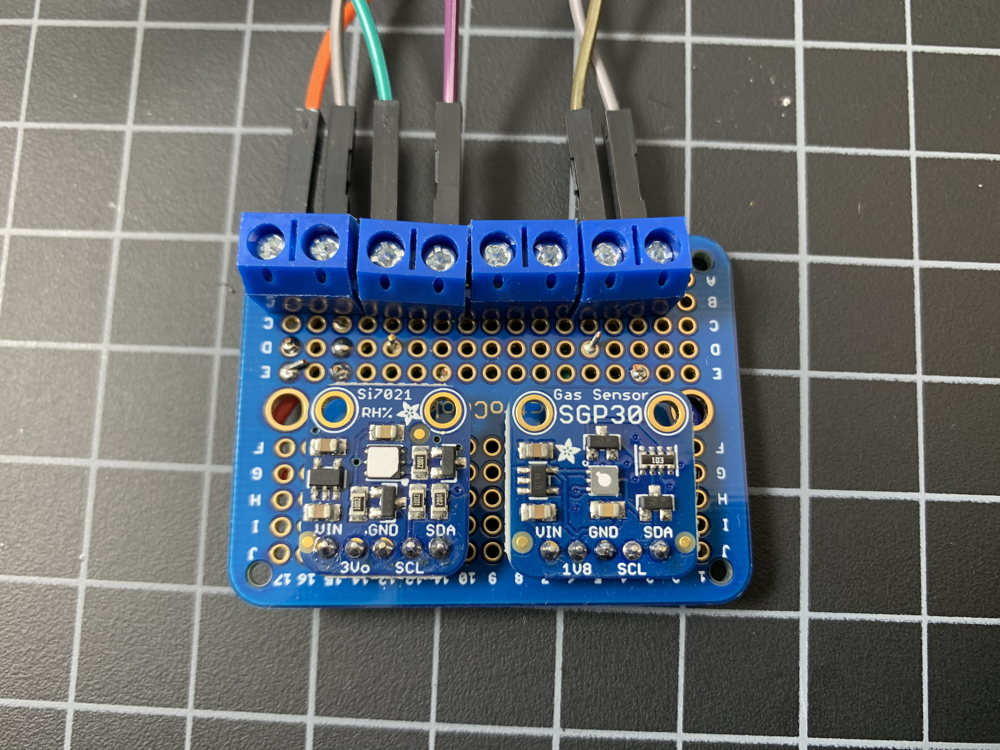
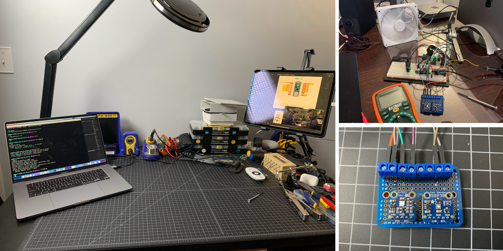

# Smart 3D Printer Air Filtration System

An Arduino-based smart air filtration and safety system for 3D printers, featuring automatic operation, VOC monitoring, and fire detection.

## Features

- Automatic fan control based on Ultimaker printer state via API
- VOC (Volatile Organic Compounds) monitoring with SGP30 sensor
- Temperature and humidity sensing with Si7021 sensor
- Fire detection with automatic printer power cutoff and alarm
- PWM fan speed control (25 kHz frequency)
- Cool-off period after print completion
- HEPA and carbon filtration
- Built-in safety features including emergency power shutoff







## Hardware Requirements

### Main Components
- Arduino Nano 33 IoT
- 140mm PWM Fan
- 12V 3A power supply
- Relay module
- HEPA filter
- Carbon filter
- Lexan sheets for enclosure

### Sensors
- Adafruit SGP30 VOC sensor
- Adafruit Si7021 temperature/humidity sensor
- Flame sensor
- TCA9548A I2C multiplexer
- Piezo alarm

## Software Dependencies

- Arduino IDE
- Required Libraries:
  - RTCZero
  - WiFiNINA
  - Scheduler
  - Wire
  - Adafruit_SGP30
  - Adafruit_Si7021
  - Adafruit_HMC5883_U

## Pin Configuration

- Fan PWM: Pin 2
- Fan Relay Enable: Pin 4
- Alarm: Pin 6
- Flame Sensor: Pin 9
- Emergency Power Shutoff: Pin 10
- Built-in LED: Pin 13

## Setup

1. Print the required enclosure parts (designs based on [this Thingiverse model](https://www.thingiverse.com/thing:3357829))
2. Cut Lexan sheets to size and assemble the enclosure
3. Wire the electronics according to the pin configuration
4. Create a `secrets.h` file with your WiFi credentials:
   ```cpp
   #define SSIDNAME "your_wifi_name"
   #define SSIDPASSWORD "your_wifi_password"
   ```
5. Configure your Ultimaker printer's IP address in the code
6. Flash the Arduino code

## Configuration

The system includes configurable parameters:
- Cool-off time (default: 10 minutes)
- Printer check interval (default: 2 minutes)
- Environment check interval (default: 15 seconds)
- Default fan speed (default: 75%)
- Cool-off fan speed (default: 100%)
- Flame detection sensitivity

## Safety Features

- Flame detection with automatic power cutoff
- Audible alarm system
- Real-time VOC monitoring
- Emergency power shutoff relay
- Fan cool-off period after printing

## Future Improvements

- Implement dynamic fan speed based on VOC levels
- Add external temperature sensor support
- Enhanced data logging capabilities

## License

See LICENSE file for details.

## Contact

For questions or feedback, contact mike@mikebuss.com

## Acknowledgments

- [Hans Peter](https://www.thingiverse.com/core2/designs) for the original enclosure design